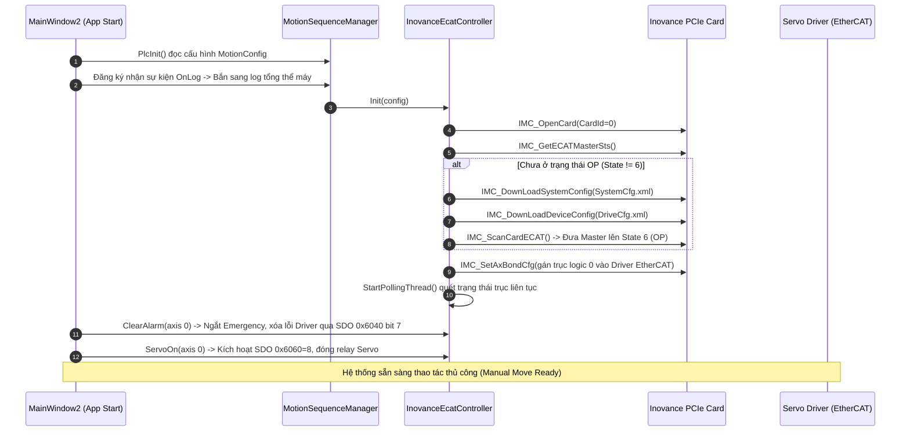

# TÀI LIỆU HƯỚNG DẪN KIẾN TRÚC & VẬN HÀNH HỆ THỐNG PC CONTROL - MACHINE VISION
## Dự án: Đếm Số Lượng & Kiểm Tra Ngược Sản Phẩm (Nitto Project)

---

## 1. TỔNG QUAN HỆ THỐNG

Dự án là hệ thống điều khiển tự động hóa cấp độ công nghiệp tích hợp giữa **PC Control** (Điều khiển chuyển động Servo EtherCAT + Khí nén + I/O) và **Machine Vision** (Xử lý hình ảnh Cognex VisionPro).

### Cấu trúc phần cứng cốt lõi:
- **Card Motion & EtherCAT Master**: Inovance PCIe Card (`IMC_API_x64.dll`) giao tiếp qua giao thức mạng EtherCAT thời gian thực.
- **Cơ cấu chấp hành Motion**: Động cơ Servo Inovance (truyền động vít me / băng tải kéo sản phẩm theo trục X).
- **Cơ cấu khí nén (Pneumatics)**:
  - Xylanh đẩy / kẹp sản phẩm (gắn cảm biến từ Sensor Forward / Backward).
  - Đầu hút chân không (Vacuum Ejector kèm cảm biến áp suất chân không).
- **Hệ thống Vision**: Camera công nghiệp kết nối card FrameGrabber / GigE, xử lý qua Cognex VisionPro `CogToolBlock` để đếm số lượng và phát hiện sản phẩm bị đặt ngược.
- **Card I/O phụ trợ**: Module Advantech / Cognex CC24 / IPC GPIO phục vụ giao tiếp tín hiệu Handshake với Robot hoặc PLC ngoài.

---

## 2. KIẾN TRÚC CÁC MODULE MÃ NGUỒN

Solution gồm 4 Project chính được phân tách rõ ràng theo nguyên tắc phân tầng trách nhiệm:

```text
nitto_product_counting/
│
├── BeevisionSolution/             # Ứng dụng giao diện chính (WPF .NET 4.8)
│   ├── Views/
│   │   ├── MainWindow2.xaml (.cs)      # Màn hình chính điều phối vòng đời app
│   │   ├── MotionControlView.xaml (.cs) # Màn hình điều khiển Motion, Teaching, I/O Monitor
│   │   ├── ImageView.xaml (.cs)        # Màn hình camera & hiển thị đồ họa Vision
│   │   └── TopPanel.xaml (.cs)         # Thanh trạng thái, chuyển model Profile, ca làm việc
│   ├── Controller/
│   │   ├── MotionSequenceManager.cs    # Quản lý chu trình tự động (StateMachine)
│   │   ├── JobController.cs            # Điều phối chạy Cognex Vision Job
│   │   └── DatamanController.cs        # Kết nối đầu đọc mã vạch Cognex Dataman
│   └── Utils/
│       ├── Common.cs                   # Quản lý đường dẫn, cấu hình toàn cục, profile
│       └── BvsLogger.cs                # Hệ thống ghi log đa luồng tốc độ cao
│
├── BeeMotionModule/               # Thư viện lõi điều khiển chuyển động EtherCAT
│   ├── Core/
│   │   ├── ImcApi.cs                   # P/Invoke các hàm C-API của Inovance Card
│   │   └── IMC_API_x64.dll             # Thư viện native 64-bit của Inovance
│   ├── InovanceEcatController.cs       # Triển khai toàn bộ logic ScanBus, Servo, Jog, PTP, IO
│   ├── IMotionController.cs            # Interface trừu tượng hóa phần cứng Motion
│   └── Models/
│       ├── MotionConfig.cs             # Cấu hình card, trục, I/O mapping, teaching points
│       ├── MotionProfile.cs            # Thông số vận tốc, gia tốc, giảm tốc
│       └── AxisState.cs                # Trạng thái phản hồi thực tế của Servo
│
├── BeeLightModule/                # Điều khiển bộ điều khiển đèn chiếu sáng công nghiệp
│   └── (Hỗ trợ RS232/Ethernet các hãng OPT, HZ, ZH...)
│
└── BeeIOModule/                   # Điều khiển các loại card I/O mở rộng (Advantech, CC24...)
```

---

## 3. LUỒNG CHẠY THỰC TẾ CỦA HỆ THỐNG

### 3.1. Luồng Khởi động Phần mềm (Startup & Init Sequence)


### 3.2. Luồng Chu trình Tự động (Auto Production Cycle)
Được điều phối trong `MotionSequenceManager.ExecuteSingleCycleAsync`:
1. **Bước 1: CheckingReady**: Kiểm tra an toàn, kiểm tra Master OP và tự động bật Servo nếu chưa bật.
2. **Bước 2: MovingToCapture**: Phát lệnh `MoveAbsolute` đưa bàn trượt tới tọa độ chụp ảnh sản phẩm (`CapturePosition`). Chờ cảm biến vị trí đến nơi (`AX_ARRIVE_BIT`).
3. **Bước 3: TriggeringVision & Processing**:
   - Bật đèn chiếu sáng (BeeLightModule).
   - Kích hoạt Camera chụp ảnh và gọi `JobController.RunJobByIdAsync`.
   - VisionPro phân tích kiểm tra: đếm số lượng tem/sản phẩm và kiểm tra chiều ngược/xuôi.
4. **Bước 4: CompensatingAndAction**:
   - Nếu **OK**: Kích hoạt van hút chân không gắp sản phẩm, hoặc chuyển sang công đoạn tiếp theo.
   - Nếu **NG**: Kích hoạt xylanh đẩy loại sản phẩm lỗi ra khay NG, dừng chu trình an toàn và phát còi báo.
5. **Bước 5: MovingToEnd & Finishing**: Bàn trượt chạy về vị trí đích/vị trí chờ để nạp sản phẩm mới. Kết thúc chu trình, tính toán thời gian chu kỳ (Tact-time ms).

---

## 4. CHI TIẾT CÁC ĐIỂM CẢI TIẾN & VỪA ĐIỀU CHỈNH

### 4.1. Nạp File Cấu Hình Card EtherCAT Theo Profile
- **Vấn đề trước đây**: Hai file `SystemCfg.xml` và `DriveCfg.xml` bị fix cứng load từ thư mục chạy gốc `bin\x64\Debug\`, dẫn tới khó tùy biến khi đổi sang model sản phẩm khác.
- **Đã cải tiến**:
  - Thuộc tính `ConfigDirectory` được bổ sung vào `MotionConfig`.
  - Trong `InovanceEcatController.ScanBus()`, hệ thống sẽ **ưu tiên tìm trong thư mục Profile hiện tại** (`Profiles\<CurrentProfile>\Configs\`), nếu không có mới tự động fallback về thư mục gốc `bin\Debug`.

### 4.2. Tự Động Ngắt Emergency, Reset Lỗi & Bật Servo Khi Mở App
- **Vấn đề trước đây**: Mỗi lần mở phần mềm, kỹ sư phải mở tab Motion rồi bấm nút bật Servo thủ công mới có thể thao tác.
- **Đã cải tiến**:
  - Tại hàm `PlcInit()` của `MainWindow2.xaml.cs`, ngay sau khi Card EtherCAT khởi tạo và đưa Master lên State 6 (OP):
    1. Tự động gọi `motion.ClearAlarm(i)`: Ngắt dừng khẩn cấp và gửi SDO CiA402 `0x6040 bit 7` để reset driver.
    2. Tự động gọi `motion.ServoOn(i)`: Đồng bộ tọa độ mã hóa `IMC_SetAxCurPos`, cấu hình chế độ CSP `0x6060 = 8` và đóng relay `IMC_AxServoOn`.
    3. Giúp kỹ sư có thể bấm JOG hoặc chạy điểm ngay tức thì khi vừa bật máy.

### 4.3. Bổ Sung Tab `I/O MONITOR` Giám Sát Thời Gian Thực
- **Giao diện**: Nằm tại `MotionControlView.xaml`.
- **Cột Trái (Inputs - DI 0..15)**:
  - Hiển thị 16 chân ngõ vào số: Cảm biến xylanh tới/lùi, cảm biến áp suất chân không, cảm biến dừng an toàn...
  - Đèn LED tròn cập nhật chu kỳ 250ms (Xanh lá khi có tín hiệu HIGH, Xám khi LOW).
- **Cột Phải (Outputs - DO 0..15)**:
  - Hiển thị 16 chân ngõ ra số: Van điện từ xylanh, van hút chân không...
  - Đèn LED trạng thái màu Cam.
  - Tích hợp nút bấm **`TOGGLE`** cho từng cổng DO: cho phép kỹ sư bấm tay bật/tắt thủ công từng van khí nén ngay trên giao diện để test bảo trì máy cực kỳ tiện dụng.

### 4.4. Hệ Thống Ghi Log Thao Tác Thủ Công Toàn Diện
- Toàn bộ thao tác bấm nút của con người trên màn hình điều khiển Motion đều được ghi log chi tiết:
  - Bấm phím **JOG + / JOG -** (kèm vận tốc mm/s và khoảng cách bước).
  - Nhả phím JOG $\rightarrow$ ghi log lệnh dừng.
  - Bấm **ABS MOVE / REL MOVE** $\rightarrow$ ghi log tọa độ đích và vận tốc.
  - Bấm **STOP** $\rightarrow$ ghi log dừng khẩn cấp toàn bộ các trục và chu trình.
  - Bấm **RESET** $\rightarrow$ ghi log xóa lỗi.
- Toàn bộ log này thông qua hàm `Motion_OnLogMessage` được đẩy song song vào:
  1. Hộp hiển thị log trực tiếp trên màn hình `MotionControlView`.
  2. Hệ thống log tổng thể của toàn máy (`Common.Info` $\rightarrow$ `appLogger` ghi lưu trữ thành file log `.log` hàng ngày trên ổ cứng).

---

## 5. HƯỚNG DẪN BẢO TRÌ & XỬ LÝ LỖI THƯỜNG GẶP

### 1. Lỗi `0x80019005` khi mở Card (Open Card Failed)
- **Nguyên nhân**: Card Inovance PCIe chỉ cho phép **duy nhất 1 tiến trình** giữ handle. Nếu mày vừa mở app test `Movi` hoặc một tiến trình cũ của `BeevisionSolution` đang chạy ngầm thì card sẽ bị khóa.
- **Cách xử lý**: Bật Task Manager (Ctrl + Shift + Esc), tìm và `End task` toàn bộ `Movi.exe` hoặc `BeevisionSolution.exe` đang chạy ngầm, sau đó khởi động lại app.

### 2. Lỗi Master không lên được `OP (State 6)`
- **Nguyên nhân**:
  - Dây mạng EtherCAT nối từ card máy tính xuống Driver bị lỏng hoặc đứt.
  - Hai file `SystemCfg.xml` và `DriveCfg.xml` chưa nằm trong thư mục chạy `bin\x64\Debug\` hoặc thư mục `Configs\` của Profile.
- **Cách xử lý**:
  - Kiểm tra đèn cổng mạng EtherCAT (phải nhấp nháy xanh).
  - Đảm bảo 2 file `SystemCfg.xml` và `DriveCfg.xml` đã được copy vào `bin\x64\Debug\` (chọn thuộc tính file trong Visual Studio là `Copy if newer`).

### 3. Động cơ không chuyển động khi bấm JOG
- **Nguyên nhân**:
  - Đèn `SvOn` chưa sáng xanh (Servo chưa ON).
  - Tọa độ mục tiêu vượt quá giới hạn hành trình mềm (`SoftwareLimitPositive` / `SoftwareLimitNegative`).
  - Cảm biến dừng an toàn / Emergency Stop đang bị kích hoạt.
- **Cách xử lý**: Nhìn bảng trạng thái `Status Matrix` trên màn hình:
  - Nếu đèn `EMG` đỏ: Kiểm tra nút dừng khẩn cấp trên máy.
  - Bấm nút **RESET** để xóa lỗi, sau đó kiểm tra đèn `SvOn` sáng rồi mới bấm JOG.

---

## 6. QUY TẮC MÃ NGUỒN CẦN NHỚ
- Tuyệt đối giữ đúng cơ chế định vị file XML cấu hình theo profile.
- Khi thêm các thao tác điều khiển mới vào giao diện `MotionControlView`, luôn sử dụng hàm `Motion_OnLogMessage(...)` để đảm bảo vừa hiển thị lên màn hình vừa được lưu trữ vào log tổng thể của nhà máy.
- Mọi đơn vị cài đặt trên UI đều tính theo **Milimet (mm)** và được tự động quy đổi sang xung thông qua hệ số `PulsesPerUnit` trong `AxisConfig`.
